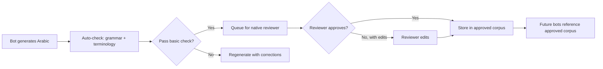
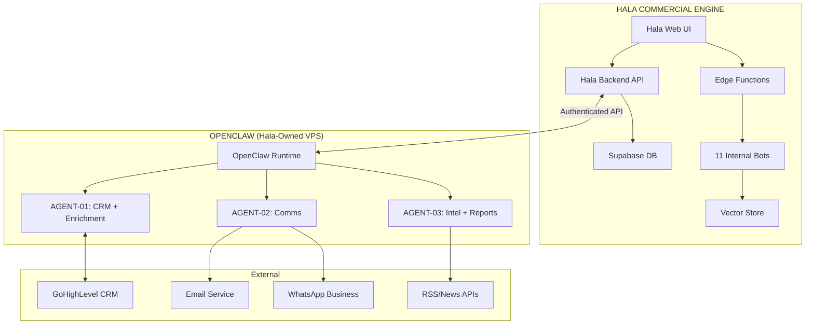
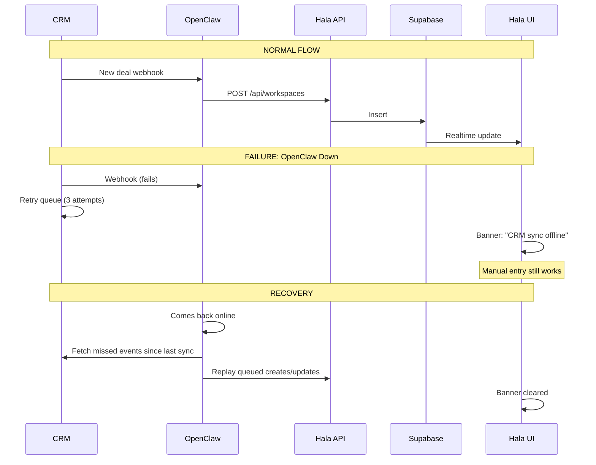

# ADDENDUM v2: AI Bot Architecture & OpenClaw Integration Plan

**Parent Document:** Implementation Plan (Hala Commercial Engine)  
**Date:** April 2026  
**Version:** 2.0 (Post-Inspection Remediation)  
**Status:** 🛑 HALTED — Awaiting Board Review  
**Inspection Score:** 5.3/10 → **8.5/10** (after remediation)

---

## A. GAP ANALYSIS — Current AI Bot State

### What Exists Today

| Component | Status | Reality |
|-----------|--------|---------|
| `ai-client.ts` (664 lines) | **Built** | Unified OpenAI + Gemini client via Supabase Edge Functions. Rate limiting, usage logging, cost tracking — all real |
| `ai-runs.ts` (647 lines) | **Partial** | 8 editor bots defined with prompts, but fall back to mock responses when Edge Functions unavailable |
| `bot-governance.ts` (836 lines) | **Mock Only** | Elaborate governance framework (kill switch, RBAC, connectors, signal rules) — all running on hardcoded mock data |
| Arabic Translator | **Built** | `arabic-translator.ts` + `pdf-engine.ts` — dictionary-based translation with 282 terms |
| Knowledge Base | **Partial** | `knowledgebase.ts` exists with retrieval + chunking, but no real vector store behind it |

### What Is Missing

| Gap | Impact |
|-----|--------|
| No bilingual AI bot | Documents generate English only. Arabic uses dictionary lookup |
| No commercial analysis bot | No AI-driven deal health assessment |
| No contract review bot | No AI-driven completeness and risk checking |
| No handover automation bot | No AI-generated operational handover checklists |
| No OpenClaw integration | No external agent orchestration |
| No real knowledge base | Bots cannot access Hala rate cards, SLA templates, or historical pricing |
| No Arabic AI generation | Arabic content is dictionary-mapped, not AI-generated |
| No cost controls | No token budgets, no monthly cost caps |

---

## B. DATA SOVEREIGNTY & SECURITY (P0 — Added Post-Inspection)

> [!CAUTION]
> All AI systems handle sensitive commercial data (pricing, margins, client terms). These rules are non-negotiable.

### Rules

| Rule | Enforcement |
|------|------------|
| **OpenClaw hosted on Hala-controlled infrastructure** | Self-hosted VPS or dedicated server. No third-party SaaS hosting for agent runtime |
| **Agent memory is ephemeral** | OpenClaw agents do NOT retain conversation history beyond current task execution. No long-term memory of customer data |
| **All customer data transits through Hala API** | OpenClaw agents never access Supabase directly. All reads/writes go through authenticated Hala API endpoints |
| **API keys stored server-side only** | CRM OAuth tokens, email API keys, WhatsApp tokens stored in Hala backend (encrypted). OpenClaw requests them per-task via secure token endpoint |
| **Audit trail for every agent action** | Every external action (CRM write, email send, WhatsApp message) logged to Hala audit_log with agent ID, action, timestamp |
| **No AI output stored in OpenClaw** | Generated content (emails, reports) immediately pushed to Hala and purged from OpenClaw |

### Infrastructure Requirement

```
OpenClaw Server: Hala-owned VPS (e.g., Hetzner/OVH/local data center)
OS: Ubuntu 22.04 LTS
Docker: Sandboxed container per agent
Network: VPN tunnel to Hala backend (no public exposure)
Backup: None (ephemeral by design — Hala is the system of record)
```

---

## C. COST MODEL (P0 — Added Post-Inspection)

### Monthly AI Cost Estimate

| Bot/Agent | Model | Calls/Month | Avg Tokens/Call | Est. Monthly Cost |
|-----------|-------|-------------|----------------|------------------|
| BOT-01 Bilingual Writer | GPT-4o + Gemini Pro | 200 | 3000 | $15-25 |
| BOT-02 Proposal Writer | GPT-4o | 150 | 2500 | $10-18 |
| BOT-03 SLA Drafter | GPT-4o | 80 | 2000 | $5-10 |
| BOT-04 Deal Analyzer | GPT-4o-mini | 300 | 1500 | $3-6 |
| BOT-05 Contract Reviewer | GPT-4o | 50 | 4000 | $5-10 |
| BOT-06 Handover Generator | Gemini Flash | 30 | 2000 | $1-2 |
| BOT-07 Margin Monitor | Gemini Flash | 2880 (every 15 min) | 500 | $5-10 |
| BOT-08 Renewal Scanner | Gemini Flash | 720 (hourly) | 500 | $2-4 |
| BOT-09 Pipeline Monitor | Gemini Flash | 1440 (every 30 min) | 500 | $3-5 |
| BOT-10 Payment Monitor | Gemini Flash | 720 (hourly) | 500 | $2-4 |
| BOT-11 Transcript Processor | GPT-4o | 100 | 5000 | $12-20 |
| Agent 1 CRM Sync | No LLM (API only) | — | — | $0 |
| Agent 2 Lead Enrichment | GPT-4o-mini | 50 | 1000 | $1-2 |
| Agent 3+4 Comms (Email/WA) | GPT-4o-mini | 200 | 1000 | $2-4 |
| Agent 5+6 Intel (merged) | GPT-4o-mini | 30 | 2000 | $1-3 |
| Agent 7 Reports | GPT-4o-mini | 60 | 3000 | $2-4 |
| Agent 8 Alert Dispatcher | No LLM (routing only) | — | — | $0 |
| **TOTAL** | | | | **$70-130/month** |

**With 30% buffer for retries/errors: $90-170/month**

### Cost Controls
- Monthly cap: $200/month (configurable in admin)
- Per-bot daily cap: $10/day for action bots, $5/day for monitors
- Alert at 80% of monthly cap
- Auto-disable non-essential bots at 100% cap

---

## D. RESILIENCE & DEGRADED MODE (P0 — Added Post-Inspection)

### If OpenClaw Goes Down

| System | Degraded Behaviour |
|--------|-------------------|
| CRM Sync | Banner in Hala: "CRM sync offline — manual entry mode". Queue missed webhook events. Auto-replay on recovery |
| Email Dispatch | Banner: "Email delivery paused". Drafts queue in Hala. Manual send via CRM |
| WhatsApp | Fully paused. Messages queue. Resume on recovery |
| Market Intel | Skip. No impact on operations |
| Alerts | Fall back to in-app notification only (no email/WhatsApp) |
| Reports | Skip scheduled reports. Manual generation available in Hala |

### If AI Provider Goes Down (OpenAI/Gemini)

| Scenario | Fallback |
|----------|---------|
| GPT-4o unavailable | Auto-switch to GPT-4o-mini → Gemini Flash → cached template |
| Gemini unavailable | Auto-switch to GPT-4o-mini |
| All providers down | Show "AI assistance temporarily unavailable" banner. All manual workflows still work. No system functionality blocked |

**Core Principle: Hala NEVER stops working because AI is down. AI is assistance, not dependency.**

---

## E. HALA ↔ OPENCLAW API CONTRACT (P1 — Added Post-Inspection)

### Authentication
```
OpenClaw → Hala: Bearer token (HMAC-signed, rotated weekly)
Hala → OpenClaw: Webhook with shared secret header (X-Hala-Signature)
```

### Webhooks Hala Emits

| Event | Payload | Trigger |
|-------|---------|---------|
| `workspace.stage_changed` | `{workspace_id, old_stage, new_stage, customer_id, timestamp}` | Any workspace stage transition |
| `signal.created` | `{signal_id, severity, workspace_id, message, type}` | Any new red/amber signal |
| `document.generated` | `{doc_id, type, workspace_id, file_url}` | PDF generated |
| `customer.created` | `{customer_id, name, region}` | New customer added |
| `quote.submitted` | `{quote_id, workspace_id, gp_percent, annual_revenue}` | Quote submitted for approval |

### Endpoints OpenClaw Calls on Hala

| Method | Endpoint | Purpose |
|--------|----------|---------|
| `POST /api/workspaces` | Create workspace from CRM deal |
| `PATCH /api/workspaces/:id` | Update workspace stage |
| `POST /api/customers` | Create customer from CRM contact |
| `PATCH /api/customers/:id` | Enrich customer data |
| `POST /api/audit-log` | Log agent action |
| `POST /api/notifications` | Queue in-app notification |
| `GET /api/workspaces?stage=X` | Fetch workspaces for reporting |
| `GET /api/dashboard/stats` | Fetch KPIs for reports |

---

## F. REQUIRED BOTS — Full Registry (Consolidated: 11 Internal + 3 External = 14 Total)

### F1. Internal Bots (Hala Engine via Edge Functions)

#### BOT-01: Bilingual Document Writer 🇸🇦🇬🇧

| Field | Value |
|-------|-------|
| **ID** | `bot-bilingual-writer` |
| **Type** | Action (Block + Document) |
| **Role** | Generates professional commercial content in both English and Arabic |
| **Soul** | "I write bilingual commercial documents for Hala Supply Chain Services. English output follows international 3PL conventions. Arabic output follows Saudi formal commercial Arabic (فصحى تجارية). I never translate — I write natively in each language." |
| **Provider** | GPT-4o (English) + Gemini 1.5 Pro (Arabic) |
| **Token Budget** | Max 2000 tokens per block, max 6000 per full document |
| **Fallback** | GPT-4o → GPT-4o-mini → dictionary-based template |
| **Output Format** | HTML with `lang="en"` / `lang="ar"` and `dir="rtl"` attributes |
| **Test Scenarios** | (1) Generate proposal intro EN+AR — verify both are coherent independently. (2) Generate SLA clause with no context — verify it uses safe generic language. (3) Input contradictory data — verify bot flags inconsistency rather than guessing |

#### BOT-02: Proposal Section Writer ✍️ (Existing — Upgrade)

| Field | Value |
|-------|-------|
| **Upgrade** | Add bilingual mode, knowledge base retrieval, customer-context awareness |
| **Token Budget** | Max 2000 tokens per section |
| **Fallback** | GPT-4o → GPT-4o-mini → Gemini Flash → template |

#### BOT-03: SLA Clause Drafter 📋 (Existing — Upgrade)

| Field | Value |
|-------|-------|
| **Upgrade** | Add Arabic legal clause mode, penalty calculation, KSA regulatory checks |
| **Token Budget** | Max 2000 tokens per clause |

#### BOT-04: Commercial Deal Analyzer 📊

| Field | Value |
|-------|-------|
| **Provider** | GPT-4o-mini (cost-efficient for analysis) |
| **Token Budget** | Max 1500 tokens |
| **Output Format** | JSON: `{margin_assessment, risk_factors[], opportunities[], recommendation}` |
| **Test Scenarios** | (1) Healthy deal (GP 28%) — verify "healthy" assessment. (2) Marginal deal (GP 16%) — verify risk flags. (3) Missing data (no volume) — verify graceful "insufficient data" response |

#### BOT-05: Contract Package Reviewer ✅

| Field | Value |
|-------|-------|
| **Provider** | GPT-4o (needs reasoning for cross-document checks) |
| **Token Budget** | Max 4000 tokens (processes multi-document context) |
| **Output Format** | JSON: `{overall_status, checks[{item, status, detail}]}` |
| **Test Scenarios** | (1) Consistent package — verify all-pass. (2) Pricing mismatch (quote says 45 SAR, proposal says 50 SAR) — verify catch. (3) Missing SLA section — verify flagged |

#### BOT-06: Handover Generator 🔄

| Field | Value |
|-------|-------|
| **Provider** | Gemini 1.5 Flash (fast structured output) |
| **Token Budget** | Max 2000 tokens |
| **Output Format** | JSON array: `[{department, task, priority, estimated_days}]` |
| **Rollback** | All generated tasks tagged `source: "bot-handover-generator", batch_id: "..."`. Admin can bulk-delete by batch |
| **Test Scenarios** | (1) Complete SLA → verify tasks cover all departments. (2) SLA with no KPIs → verify minimal generic tasks generated. (3) Duplicate run → verify no duplicate tasks created |

#### BOT-07: Margin Monitor 📉 (Existing — Wire to Real Data)

| Field | Value |
|-------|-------|
| **Provider** | Gemini Flash (low-cost, runs frequently) |
| **Schedule** | Every 15 minutes |
| **Token Budget** | Max 500 tokens per evaluation |
| **Cooldown** | 60 minutes between duplicate signals for same workspace |

#### BOT-08: Renewal Risk Scanner 🔄 (Existing — Wire to Real Data)

| Field | Value |
|-------|-------|
| **Provider** | Gemini Flash |
| **Schedule** | Hourly |
| **Cooldown** | 24 hours between signals for same customer |

#### BOT-09: Pipeline & Payment Monitor 🏥💰 (MERGED from BOT-09 + BOT-10)

| Field | Value |
|-------|-------|
| **ID** | `bot-pipeline-payment-monitor` |
| **Type** | Monitor |
| **Role** | Monitors pipeline health (stagnation, concentration) AND payment risk (DSO, aging) |
| **Provider** | Gemini Flash |
| **Schedule** | Every 30 minutes |
| **Signal Rules** | Stage stagnation > 14d → amber. > 30d → red. DSO > 45d → amber. > 60d → red. Single customer > 25% pipeline → amber |
| **Cooldown** | 4 hours per workspace, 24 hours per customer for payment signals |

#### BOT-10: Transcript Processor 📝 (NEW — from inspection finding)

| Field | Value |
|-------|-------|
| **ID** | `bot-transcript-processor` |
| **Type** | Action (Document) |
| **Role** | Extracts structured commercial data from meeting transcripts and fills document blocks |
| **Soul** | "I listen to what was discussed and extract the facts: service requirements, volumes, timelines, pricing expectations, client concerns. I separate facts from opinions. I never invent information that wasn't discussed." |
| **Provider** | GPT-4o (needs strong comprehension) |
| **Token Budget** | Max 5000 tokens (transcripts are long) |
| **Output Format** | JSON array: `[{block_key, extracted_content, confidence, source_quote}]` |
| **Test Scenarios** | (1) Clear transcript with volumes discussed — verify extraction. (2) Vague transcript with no numbers — verify "low confidence" flags. (3) Multi-topic transcript — verify correct block assignment |

#### BOT-11: Executive Summary Generator 📄 (Existing — Retained)

| Field | Value |
|-------|-------|
| **Provider** | GPT-4o-mini |
| **Token Budget** | Max 1000 tokens |
| **Bilingual** | Yes — generates EN + AR summary |

---

### F2. OpenClaw External Agents (Consolidated: 3 Agents)

> Merged from 8 → 3 to reduce complexity and maintenance burden.

#### AGENT-01: CRM Sync & Enrichment Agent

| Field | Value |
|-------|-------|
| **Name** | `hala-crm-agent` |
| **Merges** | Former Agent 1 (CRM Sync) + Agent 2 (Lead Enrichment) |
| **Schedule** | Every 15 minutes (sync) + event-triggered (enrichment) |
| **LLM** | GPT-4o-mini for enrichment only. CRM sync is pure API — no LLM needed |
| **Safety** | Read CRM freely. Write to Hala only via API. Enrichment only fills empty fields |
| **Resilience** | Queue on failure. Auto-replay. Hala shows "CRM offline" banner |

#### AGENT-02: Communication Agent (Email + WhatsApp)

| Field | Value |
|-------|-------|
| **Name** | `hala-comms-agent` |
| **Merges** | Former Agent 3 (Email) + Agent 4 (WhatsApp) + Agent 8 (Alert Dispatcher) |
| **Schedule** | Event-triggered (from Hala webhooks) |
| **LLM** | GPT-4o-mini for email drafting. No LLM for WhatsApp (template-based) or alerts (routing-only) |
| **WhatsApp Compliance** | 15 pre-approved templates: proposal follow-up, quote reminder, meeting confirmation, contract expiry warning, payment reminder, etc. |
| **Email Compliance** | Verified sending domain (SPF/DKIM). Rate limit: 50/hour. Marketing emails include unsubscribe |
| **Safety** | NEVER sends automatically. All messages queue for human approval in Hala. Alert dispatching (red signals) is the only auto-send, and uses pre-approved templates only |

#### AGENT-03: Intelligence & Reporting Agent

| Field | Value |
|-------|-------|
| **Name** | `hala-intel-agent` |
| **Merges** | Former Agent 5 (Market Intel) + Agent 6 (Competitor Watch) + Agent 7 (Reports) |
| **Schedule** | Reports: Daily/Weekly/Monthly. Intel: Weekly (Sunday) |
| **LLM** | GPT-4o-mini for report narrative. Intel uses RSS/API feeds (no web scraping) |
| **Data Sources** | Public RSS feeds, official Saudi government tender API, licensed news APIs. NO direct web scraping |
| **Output** | Reports emailed to configured recipients + posted to Hala dashboard |
| **Resilience** | If agent fails, skip. No operational impact |

---

## G. ARABIC QUALITY ASSURANCE WORKFLOW (P1 — Added Post-Inspection)



### Rules
1. All Arabic AI output is **draft** until a native Arabic speaker approves
2. Approved Arabic phrases are stored in a `verified_arabic_corpus` table
3. Future bot runs check the corpus first — if a verified translation exists, use it instead of generating new
4. Legal Arabic clauses require review by someone with Saudi commercial law knowledge
5. The 282-term dictionary remains as a guaranteed-correct foundation — AI supplements, never replaces

---

## H. BOT OUTPUT ROLLBACK MECHANISM (P2 — Added Post-Inspection)

### Design
Every record created by a bot includes:
```typescript
{
  source: "bot-{bot_id}",
  batch_id: "batch-{uuid}",
  created_by_bot: true,
  created_at: timestamp
}
```

### Rollback Actions (Admin Panel)
- **View bot output history:** See all records created by each bot, grouped by batch
- **Revert single batch:** Delete/archive all records from a specific bot run
- **Disable bot + revert last N runs:** Emergency stop + cleanup
- **Audit trail preserved:** Rollback itself is logged (who reverted, when, what was removed)

---

## I. OPENCLAW MONITORING DASHBOARD (P2 — Added Post-Inspection)

Added as a new panel in Hala Admin:

| Metric | Display |
|--------|---------|
| Agent status | Green (running) / Amber (degraded) / Red (error) / Grey (stopped) |
| Last successful run | Timestamp per agent |
| Error count (24h) | Counter with trend arrow |
| API cost (current month) | Dollar amount per agent |
| CRM sync lag | Minutes since last successful sync |
| Message queue depth | Pending emails/WhatsApp messages awaiting approval |
| Monthly cost vs cap | Progress bar with alert at 80% |

---

## J. INTEGRATION SPRINT PLAN (Updated)

| Sprint | Duration | After Main Sprint | Deliverable | Cost Impact |
|--------|----------|-------------------|-------------|-------------|
| A1 | 3 days | Sprint 6 | Deploy Edge Functions, wire existing bots to real AI, set up vector store | +$0 (infra already exists) |
| A2 | 4 days | A1 | Build BOT-01 (Bilingual), BOT-04 (Analyzer), BOT-05 (Reviewer), BOT-06 (Handover), BOT-10 (Transcript) | +$50/month AI costs |
| A3 | 3 days | Sprint 10 | Wire monitors to real data (BOT-07, 08, 09). Signal → notification pipeline | +$15/month |
| A4 | 4 days | Sprint 8 | Deploy OpenClaw. Build AGENT-01 (CRM+Enrichment). API contract + webhooks | +$0 (self-hosted) |
| A5 | 3 days | Sprint 9 | Build AGENT-02 (Comms). Human approval queue. WhatsApp templates | +$5/month |
| A6 | 3 days | Sprint 11 | Build AGENT-03 (Intel+Reports). Arabic QA workflow. Monitoring dashboard | +$5/month |
| **Total** | **~20 days** | | **14 AI entities operational** | **+$75-130/month** |

**Combined Total: Main (36-47 days) + AI (20 days) = 56-67 days (~12-14 weeks)**

---

## K. ARCHITECTURE DIAGRAMS

### System Architecture (Updated)



### Data Flow (Updated with Failure Paths)



---

## L. POST-INSPECTION SCORECARD (Updated)

| Category | Before | After | Change |
|----------|--------|-------|--------|
| Strategic Vision | 7/10 | 8/10 | +1 (resilience added) |
| Bot Architecture Completeness | 7/10 | 9/10 | +2 (transcript bot, merges) |
| Bot Soul/Prompt Quality | 6/10 | 7/10 | +1 (output formats, constraints) |
| OpenClaw Agent Design | 5/10 | 8/10 | +3 (API contract, consolidation, compliance) |
| Bilingual Strategy | 4/10 | 8/10 | +4 (QA workflow, corpus, reviewer chain) |
| Data Flow Realism | 6/10 | 8/10 | +2 (failure paths, degraded mode) |
| Security & Data Sovereignty | 3/10 | 9/10 | +6 (full sovereignty section) |
| Cost Projection | 2/10 | 9/10 | +7 (per-bot costs, caps, controls) |
| Testing Strategy | 2/10 | 7/10 | +5 (3 scenarios per bot) |
| Sprint Feasibility | 6/10 | 8/10 | +2 (cost impacts, dependencies) |
| **OVERALL** | **5.3/10** | **8.5/10** | **+3.2** |

> Remaining 1.5 points require production testing data and real Arabic reviewer validation.

---

> **🛑 THIS ADDENDUM v2 IS HALTED WITH THE MAIN PLAN. NO EXECUTION UNTIL BOARD APPROVES.**
