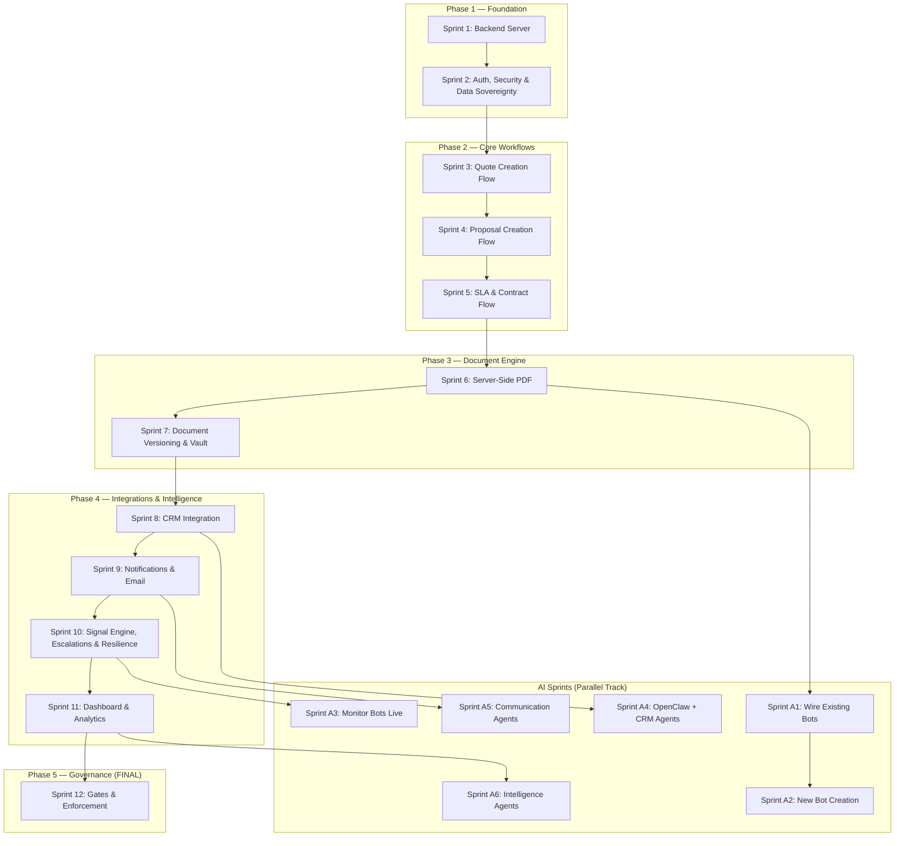

# HALA COMMERCIAL ENGINE — IMPLEMENTATION PLAN

**Version:** 2.0 (Post-Inspection Remediation)  
**Date:** April 2026  
**Inspection Score:** Applied Brigadier (Strategic) + Corporal (Tactical) findings  
**Companion Documents:** AI Bot Addendum v2, Management Roadmap, Inspection Report

> [!IMPORTANT]
> **STATUS: 🛑 HALTED — AWAITING BOARD REVIEW & APPROVAL**
> No code will be written until the board personally approves this plan.
> Governance/Gates/Lockdown are ONLY in Sprint 12 (the final sprint).
> Everything before that is open, testable, no restrictions.
> AI Sprints (A1-A6) run in parallel after their dependency sprints.

---

## Architecture Overview

---

## PHASE 1 — FOUNDATION

*Goal: Create the missing backend server, implement real authentication, and secure the database. After this phase, the app has a real server and real user sessions.*

---

### Sprint 1: Backend Server Creation
**Duration:** 3-4 days  
**Outcome:** Working Express/Hono backend with API routes that mirror existing Supabase client calls

| # | Ticket | Description | Deliverable |
|---|--------|-------------|-------------|
| 1.1 | **Create server skeleton** | Set up Express or Hono server in `server/` directory with TypeScript, cors, JSON body parsing, health check endpoint | `server/index.ts` running on port 3001, `GET /api/health` returns `{status: "ok"}` |
| 1.2 | **Move Supabase credentials server-side** | Create server-side Supabase client using service role key (not anon key). Anon key remains client-side for auth only | `server/lib/supabase.ts` with service role client |
| 1.3 | **API routes: Customers** | CRUD endpoints: `GET /api/customers`, `GET /api/customers/:id`, `POST /api/customers`, `PATCH /api/customers/:id` | Working API that proxies to Supabase with server-side validation |
| 1.4 | **API routes: Workspaces** | CRUD endpoints for workspaces including type filtering (commercial/tender/renewal) | Working workspace API |
| 1.5 | **API routes: Quotes, Proposals, Approvals** | CRUD for quotes, proposals, approval records | Working API for commercial objects |
| 1.6 | **API routes: Audit, Signals, P&L, Handover** | Remaining entity endpoints | Full API coverage |
| 1.7 | **Wire frontend to use server API** | Create `api-client.ts` on frontend that calls server endpoints instead of direct Supabase queries. Keep Supabase hooks as fallback during migration | Frontend reads/writes through server |

> [!NOTE]
> The frontend currently calls Supabase directly. After this sprint, all mutations go through the server. Reads can still go direct to Supabase for speed (with RLS in Sprint 2).

---

### Sprint 2: Authentication, Database Security & Data Sovereignty
**Duration:** 3-4 days  
**Outcome:** Real user login, role-based data access, database rows protected, data sovereignty rules established

| # | Ticket | Description | Deliverable |
|---|--------|-------------|-------------|
| 2.1 | **Supabase Auth: Login flow** | Wire the existing Login.tsx page to Supabase Auth (email/password). On success, set user session and call `setGlobalAuthUser()` | Real login that creates a Supabase session |
| 2.2 | **Supabase Auth: Session persistence** | Implement session refresh, logout, and protected routes. User stays logged in across page refreshes | Persistent auth sessions |
| 2.3 | **Seed user accounts** | Create real Supabase Auth accounts for the 7 users defined in store.ts (Amin, Ra'ed, Albert, Hano, Yazan, Mohammed, Tariq) with their roles | 7 real user accounts that can log in |
| 2.4 | **Server-side auth middleware** | Extract Supabase JWT from `Authorization` header on all API routes. Reject unauthenticated requests. Attach `user` to request context | All API routes require valid auth |
| 2.5 | **RLS policies: Core tables** | Write Supabase RLS policies for customers, workspaces, quotes, proposals, approval_records, audit_log. All authenticated users can read. Writes require auth | Data protected at database level |
| 2.6 | **Role display in UI** | Show current user name + role in sidebar. Allow dev-mode role switching for testing (dropdown in sidebar — NOT a gate, just a test helper) | Visible user identity, easy role testing |
| 2.7 | **Data sovereignty rules** | Document and enforce: all customer data stays in Supabase (Hala-controlled). No third-party agent stores customer data long-term. All external integrations (future) must transit through Hala API. Establish audit_log table with `source` field for bot vs human actions | Data sovereignty policy enforced at architecture level |
| 2.8 | **Bot output tagging schema** | Add `source`, `batch_id`, `created_by_bot` columns to all content tables. Enables future rollback of any bot-generated batch | Infrastructure for AI rollback mechanism |

---

## PHASE 2 — CORE WORKFLOWS

*Goal: Build the actual user journeys for creating Quotes, Proposals, and SLAs. These are the core commercial flows that currently only exist as list views. After this phase, a user can walk through the full Opportunity → Quote → Proposal → SLA → Contract flow.*

---

### Sprint 3: Quote Creation Flow
**Duration:** 3-4 days  
**Outcome:** User can create, edit, version, and submit quotes from within a workspace

| # | Ticket | Description | Deliverable |
|---|--------|-------------|-------------|
| 3.1 | **Quote wizard component** | Multi-step form inside WorkspaceDetail: (1) Service scope selection (WH/TP/VAS), (2) Volume assumptions (pallets, inbound, outbound), (3) Pricing input (rates per service), (4) Review with margin preview | `<QuoteWizard>` component that creates a quote |
| 3.2 | **Quote P&L auto-calculation** | When user enters rates + volumes, auto-compute: monthly revenue, annual revenue, cost estimate, GP%, GP amount. Show margin indicator (green >25%, amber 15-25%, red <15%) — display only, no blocking | Real-time P&L preview in the wizard |
| 3.3 | **Quote versioning** | When editing an existing approved quote, auto-create a new version (v2, v3...). Previous versions marked as "superseded". Show version history list | Quote version chain with history |
| 3.4 | **Quote status transitions** | Allow status changes: Draft → Submitted → Approved/Rejected. Show status badge on each quote. Log transition to audit trail | Working quote lifecycle (no gates, just status tracking) |
| 3.5 | **Quote validity period** | Add validity period field (default 30 days). Show expiry date. Display "Expired" badge if past validity | Quote expiry tracking |
| 3.6 | **Quote assumptions & exclusions** | Add text fields for mandatory assumptions and exclusions per Doctrine requirement. These flow into PDF generation | Assumptions/exclusions captured on every quote |

---

### Sprint 4: Proposal Creation Flow
**Duration:** 3-4 days  
**Outcome:** User can create proposals from approved quotes, with version tracking and negotiation support

| # | Ticket | Description | Deliverable |
|---|--------|-------------|-------------|
| 4.1 | **Proposal wizard component** | Create proposal from within workspace. Must select a quote to base it on. Auto-populate pricing from quote. Add: executive summary, scope description, service highlights | `<ProposalWizard>` component |
| 4.2 | **Proposal-Quote linkage** | Each proposal must reference a specific quote version. Show linked quote badge. Quote pricing displayed as read-only in the proposal | Proposal locked to quote version |
| 4.3 | **Indicative language safeguard** | If no SLA exists for the workspace, auto-insert the standard disclaimer: "Service levels are indicative and subject to final SLA agreement." — as a visible banner, not a block | Auto-disclaimer per Doctrine |
| 4.4 | **Proposal versioning** | Same pattern as quotes: editing creates new version, old one superseded. Version history with change reason capture | Proposal version chain |
| 4.5 | **Proposal status flow** | Draft → Ready for CRM → Sent → Negotiation Active → Approved/Rejected. Log all transitions | Working proposal lifecycle |
| 4.6 | **Negotiation notes** | On each proposal version, add a "Negotiation Notes" field: why was this version created? What changed? What did the client request? | Change reason audit trail |

---

### Sprint 5: SLA & Contract Flow
**Duration:** 3-4 days  
**Outcome:** User can create SLAs and mark contracts as ready/sent/signed

| # | Ticket | Description | Deliverable |
|---|--------|-------------|-------------|
| 5.1 | **SLA creation wizard** | Create SLA from within workspace. Pre-populate SLA rows from template (existing `getSampleSLARows()`). Add: KPIs, measurement methods, penalties, exclusions, customer responsibilities | `<SLAWizard>` component |
| 5.2 | **SLA-Quote-Proposal linkage** | SLA must reference which proposal/quote it's linked to. Show the lineage: Quote v2 → Proposal v3 → SLA v1 | Document lineage tracking |
| 5.3 | **SLA status flow** | Not Started → Draft → Operational Review → Submitted → Approved. Log transitions | Working SLA lifecycle |
| 5.4 | **Contract readiness checklist** | Show a checklist in workspace: ☑ Quote approved, ☑ Proposal approved, ☑ SLA approved. Display as info only — no blocking | Visual contract readiness indicator |
| 5.5 | **Contract status tracking** | Add "Contract Sent" and "Contract Signed" status to workspace. Allow marking these dates. Log to audit | Contract lifecycle completion |
| 5.6 | **Workspace stage auto-suggestion** | When a quote is approved, suggest moving workspace to "Proposal Active". When proposal approved, suggest "SLA Drafting". As toast notifications, not forced transitions | Helpful stage suggestions |

---

## PHASE 3 — DOCUMENT ENGINE

*Goal: Make PDF generation server-side and implement document versioning. After this phase, documents are professional, versioned, and stored.*

---

### Sprint 6: Server-Side PDF Generation
**Duration:** 3-4 days  
**Outcome:** PDFs generated on server with proper formatting, stored in Supabase Storage

| # | Ticket | Description | Deliverable |
|---|--------|-------------|-------------|
| 6.1 | **Puppeteer setup on server** | Install Puppeteer on the backend server. Create `server/lib/pdf-generator.ts` that takes HTML string → returns PDF buffer | Server-side HTML-to-PDF conversion |
| 6.2 | **PDF generation API endpoint** | `POST /api/documents/generate-pdf` — accepts render context, generates HTML using existing `pdf-renderer.ts` logic (ported to server), converts to PDF, returns file | Working PDF generation endpoint |
| 6.3 | **Supabase Storage integration** | Create `documents` bucket in Supabase Storage. Upload generated PDFs with structured naming: `{customer}/{workspace}/{type}-v{version}-{date}.pdf` | PDFs stored in cloud storage |
| 6.4 | **PDF download from UI** | Replace client-side "Download HTML" with "Download PDF" button that calls the server endpoint and downloads a real PDF | Real PDF download in PDF Studio |
| 6.5 | **Compile from workspace** | Add "Generate PDF" button in workspace detail that compiles the current quote/proposal/SLA into a PDF using the selected template and stores it | One-click document generation from workspace |

---

### Sprint 7: Document Versioning & Vault
**Duration:** 2-3 days  
**Outcome:** All generated documents are versioned, immutable, and browsable in a document vault

| # | Ticket | Description | Deliverable |
|---|--------|-------------|-------------|
| 7.1 | **Document version records** | Each generated PDF creates a `doc_compiled_outputs` record with: type, version, workspace_id, quote_id, proposal_id, sla_id, file_url, generated_by, generated_at | Immutable document version records |
| 7.2 | **Document vault browser** | Upgrade existing Documents.tsx page to show real stored documents grouped by workspace/customer. Click to preview/download | Working document vault |
| 7.3 | **Version history in workspace** | Wire the existing `VersionHistoryPanel` component to show real document versions with timestamps and who generated them | Real version history |
| 7.4 | **Document comparison** | Side-by-side view of two document versions (v1 vs v2) showing what changed (pricing delta, term changes) | Version diff capability |

---

## PHASE 4 — INTEGRATIONS & INTELLIGENCE

*Goal: Connect to external systems (CRM, email) and automate business intelligence (signals, escalations). After this phase, the system talks to the outside world.*

---

### Sprint 8: CRM Integration
**Duration:** 4-5 days  
**Outcome:** Real two-way sync with GHL/Zoho CRM

| # | Ticket | Description | Deliverable |
|---|--------|-------------|-------------|
| 8.1 | **CRM OAuth setup** | Implement OAuth 2.0 flow for GHL (GoHighLevel) or Zoho CRM. Store tokens in Supabase. Admin page to configure API keys | Working CRM authentication |
| 8.2 | **Inbound sync: Contacts** | Fetch contacts from CRM, create/update customers in Hala. Map CRM fields to Hala customer fields using configurable field mapping | CRM contacts → Hala customers |
| 8.3 | **Inbound sync: Opportunities/Deals** | Fetch opportunities from CRM pipeline, create workspaces for "Qualified" deals. Map CRM stages to workspace stages | CRM deals → Hala workspaces |
| 8.4 | **Outbound sync: Stage updates** | When workspace stage changes in Hala, push stage update to CRM deal. Log sync event | Hala stage → CRM stage |
| 8.5 | **Outbound sync: Document attachments** | When a PDF is generated, optionally push to CRM as deal attachment | Documents pushed to CRM |
| 8.6 | **CRM Sync Console: Live data** | Replace mock data in CRM Sync Console with real sync event logs from the database | Real sync monitoring |
| 8.7 | **Sync conflict handling** | When CRM stage and Hala stage disagree, show a conflict banner in workspace (info only, no block) | Conflict visibility |

---

### Sprint 9: Notifications & Email
**Duration:** 2-3 days  
**Outcome:** System sends real emails for key events

| # | Ticket | Description | Deliverable |
|---|--------|-------------|-------------|
| 9.1 | **Email service setup** | Configure Resend or SendGrid on the backend server. Create email templates for: approval request, stage change, contract expiry warning | Email sending capability |
| 9.2 | **Approval request emails** | When a quote/proposal is submitted for approval, email the appropriate approvers with a link to review | Approval notification emails |
| 9.3 | **Stage change notifications** | When workspace stage changes, email the workspace owner and relevant stakeholders | Stage change emails |
| 9.4 | **Contract expiry warnings** | Server cron job (daily): check contracts expiring within 90/60/30 days, email account owners | Automated expiry alerts |
| 9.5 | **In-app notification center** | Add notification bell in header. Store notifications in a `notifications` table. Mark as read/unread | In-app notification system |

---

### Sprint 10: Signal Engine, Escalations & Resilience Design
**Duration:** 4-5 days  
**Outcome:** Signals auto-generated from data, escalations triggered with real timers, system resilience for external failures

| # | Ticket | Description | Deliverable |
|---|--------|-------------|-------------|
| 10.1 | **Auto-generate margin signals** | On workspace save: if GP% < 15%, create amber signal. If GP% < 10%, create red signal. If GP% > 25%, create green signal | Automated margin intelligence |
| 10.2 | **Auto-generate payment signals** | On customer data: if DSO > 60 days, create red signal. If DSO > 45, amber. Link to customer and active workspaces | Payment risk intelligence |
| 10.3 | **Auto-generate stage aging signals** | Server cron: if workspace has been in same stage > X days (configurable), create amber/red signal | Stage stagnation detection |
| 10.4 | **Escalation triggers** | When red signals exist for > 48 hours with no action, create escalation record. Show in Escalation page with timer | Time-based escalation |
| 10.5 | **Escalation assignment** | Auto-assign escalations to the next level up (salesman → regional head → director → CEO). Show assigned person | Escalation routing |
| 10.6 | **Degraded mode: CRM offline banner** | When CRM sync fails 3 consecutive times, show persistent banner: "CRM sync offline — manual entry mode". Auto-clear when sync recovers. Queue missed webhook events for replay | Graceful CRM failure handling |
| 10.7 | **Degraded mode: AI offline banner** | When AI provider (OpenAI/Gemini) returns errors, show banner: "AI assistance temporarily unavailable". All manual workflows unaffected. Auto-switch to fallback provider chain (GPT-4o → GPT-4o-mini → Gemini Flash → template) | AI failure resilience |
| 10.8 | **External service health monitor** | Server endpoint that checks: CRM API status, AI provider status, email service status. Show as traffic-light indicators in Admin panel | External dependency visibility |

---

### Sprint 11: Dashboard & Analytics
**Duration:** 2-3 days  
**Outcome:** Dashboard shows real KPIs from live data, not mock stats

| # | Ticket | Description | Deliverable |
|---|--------|-------------|-------------|
| 11.1 | **Remove mock stats fallback** | Delete `getDashboardStats()` from store.ts. All dashboard KPIs computed from Supabase queries | No more mock data on dashboard |
| 11.2 | **Pipeline value computation** | Server endpoint: compute total pipeline value, avg GP%, stage distribution from real workspace data | Real pipeline analytics |
| 11.3 | **Revenue exposure calculation** | Compute: contracts expiring within 90 days × contract value = revenue at risk. Show on dashboard | Revenue exposure metric |
| 11.4 | **Customer portfolio health** | ECR scores aggregated: how many A/B/C/D/F customers. Revenue concentration by grade | Portfolio health view |
| 11.5 | **Activity feed** | Dashboard shows last 20 audit trail entries as a live activity feed | Real-time activity visibility |

---

## PHASE 5 — GOVERNANCE & ENFORCEMENT (FINAL SPRINT)

> [!CAUTION]
> **This phase is LAST on purpose.** It only runs after ALL other sprints are complete, real data flows from CRM, and the system has been tested thoroughly in open mode. No prisons until the building is finished.

---

### Sprint 12: Gates, Rules & Enforcement
**Duration:** 3-4 days  
**Outcome:** Policy gates can be activated to enforce business rules. OFF by default. Admin turns them on when ready.

| # | Ticket | Description | Deliverable |
|---|--------|-------------|-------------|
| 12.1 | **Remove DEV_MODE** | Remove the `DEV_MODE = true` bypass from governance.ts. Gates now evaluate for real — but all gates default to mode: "off" in the database | Gates evaluate but are disabled by default |
| 12.2 | **Commercial Approval Gate** | When mode = "enforce": Quote submission requires approval from role matching GP%/volume thresholds. Shows "Approval Required" banner (not a hard block — user can still proceed but it's logged) | GP% approval requirements |
| 12.3 | **SLA Creation Gate** | When mode = "enforce": SLA creation shows a warning if no approved proposal exists. Warn mode shows banner. Off mode does nothing | SLA timing enforcement |
| 12.4 | **Pricing Lock Gate** | When mode = "enforce": After quote is approved, editing pricing shows a warning that a new version will be created. Not a block — just awareness | Pricing change awareness |
| 12.5 | **Admin toggle panel** | Admin Panel shows all gates with Enforce/Warn/Off toggle. Changes take effect immediately. Show audit log of who changed what | Admin-controlled gate management |
| 12.6 | **Margin threshold configuration** | Move hardcoded GP% thresholds (10%, 22%, 25%) into admin-configurable database settings | Configurable business rules |
| 12.7 | **Governance audit logging** | Every gate evaluation (pass/warn/block) logged to audit trail with: gate name, result, user, context data | Full governance traceability |

---

## TIMELINE SUMMARY

### Main Track (Sequential)

| Phase | Sprint | Duration | Key Deliverable |
|-------|--------|----------|----------------|
| **1 — Foundation** | Sprint 1 | 3-4 days | Backend server with API routes |
| | Sprint 2 | 3-4 days | Auth + RLS + data sovereignty |
| **2 — Core Workflows** | Sprint 3 | 3-4 days | Quote creation + versioning |
| | Sprint 4 | 3-4 days | Proposal creation + negotiation |
| | Sprint 5 | 3-4 days | SLA + contract lifecycle |
| **3 — Documents** | Sprint 6 | 3-4 days | Server-side PDF generation |
| | Sprint 7 | 2-3 days | Document versioning + vault |
| **4 — Integrations** | Sprint 8 | 4-5 days | CRM integration (GHL/Zoho) |
| | Sprint 9 | 2-3 days | Email notifications |
| | Sprint 10 | 4-5 days | Signal engine + escalations + resilience |
| | Sprint 11 | 2-3 days | Dashboard real analytics |
| **5 — Governance** | Sprint 12 | 3-4 days | Gates + enforcement (LAST) |
| | **Main Total** | **~38-49 days** | **Production-ready MVP** |

### AI Track (Parallel — see AI Bot Addendum v2 for full details)

| Sprint | Duration | Runs After | Key Deliverable | Monthly Cost Impact |
|--------|----------|-----------|-----------------|--------------------|
| A1 | 3 days | Sprint 6 | Wire existing bots to real AI providers + vector store | +$0 |
| A2 | 4 days | A1 | 5 new bots (Bilingual, Analyzer, Reviewer, Handover, Transcript) | +$50/month |
| A3 | 3 days | Sprint 10 | Monitor bots on real data, signal → notification pipeline | +$15/month |
| A4 | 4 days | Sprint 8 | Deploy OpenClaw, CRM Sync + Enrichment Agent | +$0 (self-hosted) |
| A5 | 3 days | Sprint 9 | Communication Agent (email + WhatsApp), human approval queue | +$5/month |
| A6 | 3 days | Sprint 11 | Intelligence Agent (reports + market intel), Arabic QA workflow | +$5/month |
| **AI Total** | **~20 days** | *(parallel)* | **14 AI entities operational** | **+$75-130/month** |

### Combined Timeline

| Scenario | Duration |
|----------|----------|
| Main track only | 38-49 days (~8-10 weeks) |
| Main + AI (parallel) | 56-67 days (~12-14 weeks) |
| Monthly AI operating cost | $90-170/month |

---

## GROUND RULES

1. **No gates fire until Sprint 12** — the system stays completely open for testing throughout Phases 1-4
2. **Every sprint produces testable output** — you can use the app after each sprint
3. **No mock data additions** — we only build on real Supabase data from Sprint 1 onward
4. **CRM is the data source** — once Sprint 8 is done, customers and deals flow in from CRM, not manual entry
5. **Governance is admin-controlled** — even in Sprint 12, all gates default to "off" and admin turns them on when ready
6. **No AI prisons** — governance warns, it never hard-blocks. Human can always override with audit logging
7. **Data sovereignty** — all customer data stays on Hala-controlled infrastructure. OpenClaw agents use ephemeral memory only. No third-party stores customer data long-term
8. **Hala never stops if AI is down** — AI is assistance, not dependency. Every AI-assisted task has a manual fallback. Provider failures trigger auto-switch (GPT-4o → GPT-4o-mini → Gemini Flash → template)
9. **AI costs are capped** — monthly cap of $200, per-bot daily caps, alert at 80%. Admin can disable non-essential bots at budget limit
10. **Any bot output can be reversed** — all bot-generated records are tagged with source + batch_id. Admin can bulk-revert any bot run with one action
11. **Arabic AI output is always draft** — Arabic content generated by bots must be reviewed by a native speaker before client delivery. Approved phrases are stored in a verified corpus for reuse

---

## OPEN QUESTIONS FOR BRAINSTORM

> [!IMPORTANT]
> These need your input before we start.

1. **Which CRM?** GHL (GoHighLevel/DNA Supersystems) or Zoho CRM? This affects Sprint 8 significantly.
2. **Backend framework preference?** Express.js (mature, huge ecosystem) or Hono (lightweight, edge-ready)? Both work with Supabase.
3. **Email service?** Resend (developer-friendly, free tier) or SendGrid (enterprise, more features)?
4. **Server hosting?** Run locally for now, or deploy to Railway/Vercel/Cloudflare Workers?
5. **Sprint order flexibility?** If you need CRM integration sooner (Sprint 8), we can move it before the Document Engine (Phase 3). What matters most to you right now?
6. **PDF engine?** Puppeteer (heavy but perfect output) or lighter alternatives like jsPDF (client-side) or wkhtmltopdf?
7. **Which customers/workspaces should be seeded first?** Use the existing 12 mock customers as initial seed data, or start fresh from CRM?

---

## COST MODEL SUMMARY

| Cost Category | Monthly Estimate |
|--------------|------------------|
| AI providers (OpenAI + Google) | $90-170 |
| OpenClaw hosting (self-hosted VPS) | $20-40 |
| Email service (Resend/SendGrid) | $0-20 (free tier likely sufficient) |
| Supabase (existing) | Already paid |
| **Total operational cost** | **$110-230/month** |

> See AI Bot Addendum v2 for per-bot cost breakdown.

---

## RELATED DOCUMENTS

| Document | Purpose |
|----------|---------|
| ADDENDUM_AI_BOTS_OPENCLAW.md | Full AI bot registry, OpenClaw agent design, API contracts, cost model |
| AI_ASSISTANTS_MANAGEMENT_GUIDE.md | Plain-language AI guide for management and staff |
| AI_BOT_INSPECTION_REPORT.md | Brigadier + Corporal inspection findings and before/after scorecard |
| IMPLEMENTATION_ROADMAP_MANAGEMENT.md | Management-facing roadmap (no jargon) |
| MASTER_VIBE_AUDIT_PROMPT.md | Reusable audit prompt for future applications |

---

> **🛑 THIS PLAN IS HALTED. NO EXECUTION UNTIL THE BOARD APPROVES.**
